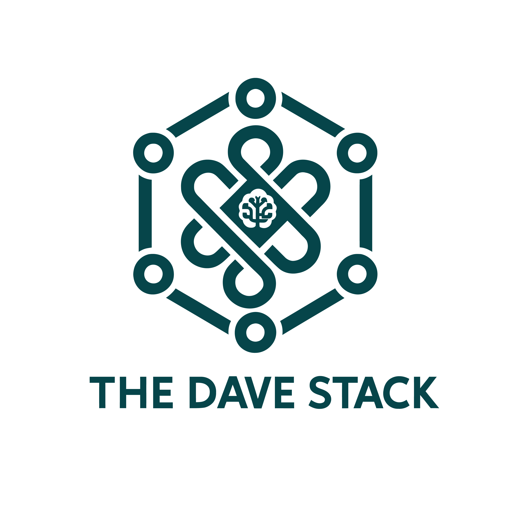

[English](#english-version) | [Español](#version-español)
---

## 🇬🇧 Welcome to The Dave Stack! (English Version)

  

<h1 align="center">The Dave Stack</h1>

  <em>Deploying the future of technology, one stack at a time.</em>

Hi! I'm David, an IT professional based in Barcelona with experience since 2007 in designing, developing, and deploying software. **The Dave Stack** is my digital space where I combine my freelance IT services with my passion for Artificial Intelligence and the desire to build a tech-savvy community.

This GitHub organization is the technical heart of The Dave Stack. Here you'll find:

* 🚀 **Portfolio Projects:** Showcasing my work and capabilities.
* 🔧 **Open Source Tools:** Utilities and solutions I develop and share with the community.
* 📚 **Code Samples & Resources:** Supporting materials for the articles and future courses on [my website](https://www.thedavestack.com).

I'm focused on building robust solutions and sharing knowledge in areas like:

* ⚙️ **Modern Application Deployment:** Optimizing pipelines and ensuring efficient deliveries.
* 🧠 **Artificial Intelligence Exploration:** Researching and applying AI to solve interesting problems.
* 🌐 **Content Creation & Community Building:** Sharing learnings and connecting with fellow tech enthusiasts.

---

### 🛠️ My Core Tech Stack

I work with a variety of technologies, including but not limited to:

* **Languages:** Java, JavaScript/TypeScript
* **Frameworks:** Spring Boot, Angular, React, Node.js (mention your most used or those you want to highlight)
* **Databases:** SQL (PostgreSQL, MySQL), NoSQL (ArangoDB, MongoDB, Redis)
* **DevOps & Cloud:** Docker, Dokploy

---

### ✨ Featured Projects & Contributions

* **[aesto](https://github.com/The-Dave-Stack/aesto):** The custom Ghost theme powering [The Dave Stack website](https://www.thedavestack.com). A glimpse into how I like to take care of the details!
* *More exciting projects and tools are on the way! Follow along for updates.*

---

### 🌐 Let's Connect!

I'd love to hear from you, whether it's to chat about technology, explore a collaboration, or if you need help with your IT projects.

* 💼 **Visit my website & portfolio:** [thedavestack.com](https://www.thedavestack.com)
* 📄 **Connect on LinkedIn:** [The Dave Stack Page](https://www.linkedin.com/company/the-dave-stack/) - [Personal Profile](https://www.linkedin.com/in/davidlopezdavid/)
* 🐦 **Follow me on X:** [The Dave Stack](https://x.com/TheDaveStack)
* 🦋 **Catch me on Bluesky:** [Personal Profile](https://bsky.app/profile/telco2011.bsky.social)
* 📧 **Interested in my freelance services?** Contact me via [my website](https://www.thedavestack.com/contact) or email me at [david@thedavestack.com](mailto:david@thedavestack.com).

---

### 🌱 Currently Exploring / Fun Fact

* Fun fact: Since starting in IT back in 2007, I've seen so many technologies born and evolve that almost nothing surprises me anymore (almost)! 😉

---
---

## 🇪🇸 ¡Bienvenido a The Dave Stack! (Versión en Español)

  

<h1 align="center">The Dave Stack</h1>

  <em>Desplegando el futuro de la tecnología, un stack a la vez.</em>

¡Hola! Soy David, un profesional de IT con base en Barcelona y experiencia desde 2007 diseñando, desarrollando y desplegando software. **The Dave Stack** es mi rincón digital donde combino mi trabajo freelance en servicios de TI con mi pasión por la Inteligencia Artificial y el deseo de construir una comunidad alrededor del conocimiento tecnológico.

Esta organización en GitHub es el corazón técnico de The Dave Stack. Aquí encontrarás:

* 🚀 **Proyectos de Portfolio:** Demostraciones de mi trabajo y capacidades.
* 🔧 **Herramientas Open Source:** Utilidades y soluciones que voy creando y compartiendo con la comunidad.
* 📚 **Ejemplos de Código y Recursos:** Material de apoyo para los artículos y futuros cursos de [mi web](https://www.thedavestack.com).

Estoy enfocado en construir soluciones robustas y compartir conocimiento en áreas como:

* ⚙️ **Despliegue de Aplicaciones Modernas:** Optimizando pipelines y asegurando entregas eficientes.
* 🧠 **Exploración en Inteligencia Artificial:** Investigando y aplicando la IA para resolver problemas интересных.
* 🌐 **Creación de Contenido y Comunidad:** Compartiendo aprendizajes y conectando con otros entusiastas de la tecnología.

---

### 🛠️ Mi Stack Tecnológico Principal

Trabajo con una variedad de tecnologías, incluyendo pero no limitado a:

* **Lenguajes:** Java, JavaScript/TypeScript
* **Frameworks:** Spring Boot, Angular, React, Node.js (menciona los que más uses o quieras destacar)
* **Bases de Datos:** SQL (PostgreSQL, MySQL), NoSQL (ArangoDB, MongoDB, Redis)
* **DevOps y Cloud:** Docker, Dokploy

---

### ✨ Proyectos y Contribuciones Destacadas

* **[aesto](https://github.com/The-Dave-Stack/aesto):** El tema personalizado de Ghost que potencia mi web [The Dave Stack](https://www.thedavestack.com). ¡Un vistazo a cómo me gusta cuidar los detalles!
* *¡Más proyectos y herramientas emocionantes están en camino! Sígueme para no perderte las novedades.*

---

### 🌐 ¡Conectemos!

Me encantaría saber de ti, ya sea para charlar sobre tecnología, explorar una colaboración o si necesitas ayuda con tus proyectos de IT.

* 💼 **Visita mi web y portfolio:** [thedavestack.com](https://www.thedavestack.com)
* 📄 **Conecta en LinkedIn:** [Página de The Dave Stack](https://www.linkedin.com/company/the-dave-stack/) - [Perfil Personal](https://www.linkedin.com/in/davidlopezdavid/)
* 🐦 **Sígueme en X:** [The Dave Stack](https://x.com/TheDaveStack)
* 🦋 **Encuéntrame en Bluesky:** [Perfil Personal](https://bsky.app/profile/telco2011.bsky.social)
* 📧 **¿Interesado en mis servicios freelance?** Contáctame a través de [mi web](https://www.thedavestack.com/contact) o envíame un correo a [david@thedavestack.com](mailto:david@thedavestack.com).

---

### 🌱 Actualmente Explorando / Dato Curioso

* Dato curioso: ¡Desde que empecé en IT en 2007, he visto nacer y evolucionar tantas tecnologías que ya nada me sorprende (mucho)! 😉